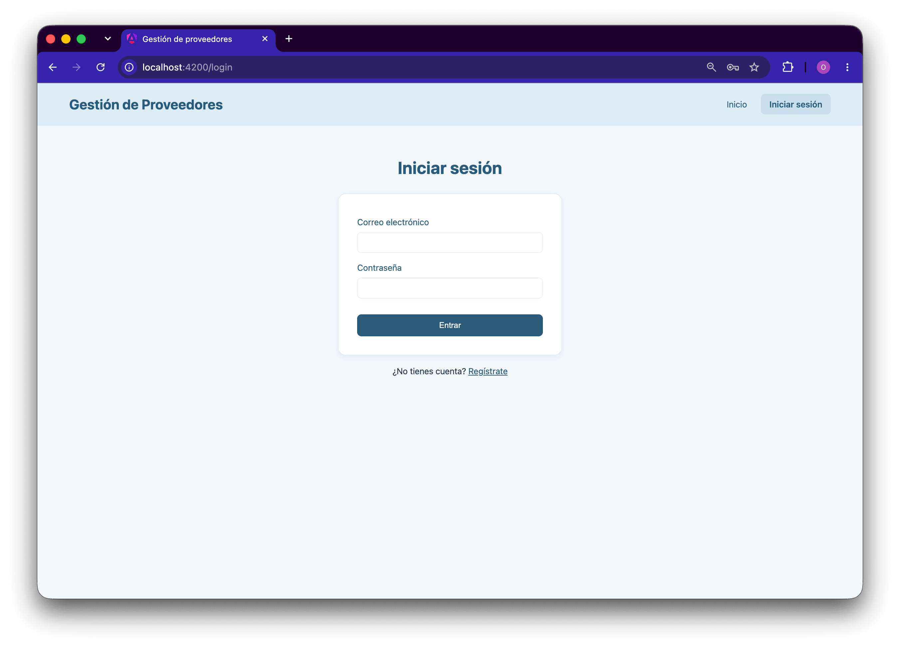
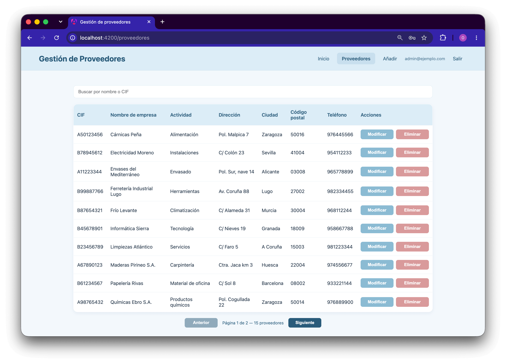
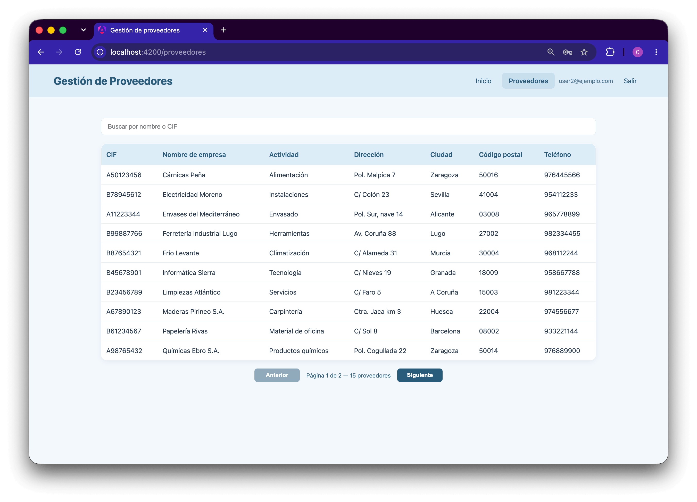

# Gestión de Proveedores

Aplicación web para gestionar un catálogo de proveedores, con inicio de sesión
y permisos por rol. Frontend en Angular 21 contra una API REST en Node.js.

- **Frontend:** este repositorio
- **Backend:** [Angular-NodeJS-Backend](https://github.com/OselkoNico/Angular-NodeJS-Backend)

## Capturas



Listado con buscador y paginación, visto por un administrador:



El mismo listado desde una cuenta sin privilegios: las acciones de modificación
y borrado no se muestran a quien no puede ejecutarlas.



## Stack

| Capa           | Tecnología                                                               |
| -------------- | ------------------------------------------------------------------------ |
| Frontend       | Angular 21 (standalone components, signals, control flow `@if` / `@for`) |
| Formularios    | Reactive Forms                                                           |
| Autenticación  | JWT en cabecera, mediante interceptor                                    |
| Pruebas        | Vitest                                                                   |
| Lenguaje       | TypeScript 5.9                                                           |

## Puesta en marcha

Requiere Node.js 22 o superior. Son **dos repositorios independientes**: hay
que levantar los dos, cada uno en su terminal.

**1. La API**, siguiendo las instrucciones de su repositorio:

```bash
git clone https://github.com/OselkoNico/Angular-NodeJS-Backend.git
cd Angular-NodeJS-Backend/Backend
npm install
mysql -u root -p < schema.sql
mysql -u root -p --default-character-set=utf8mb4 < seed.sql   # datos de ejemplo
cp .env.example .env                                          # credenciales y JWT_SECRET
npm run crear-admin -- admin@ejemplo.com micontrasena123
npm start
```

**2. El frontend:**

```bash
git clone https://github.com/OselkoNico/gestion-proveedores.git
cd gestion-proveedores
npm install
npm start
```

Abrir <http://localhost:4200> e iniciar sesión con el administrador creado en
el paso anterior, o registrar una cuenta nueva desde la propia aplicación.

## Funcionalidad

| Ruta               | Pantalla                    | Acceso        |
| ------------------ | --------------------------- | ------------- |
| `/`                | Bienvenida                  | Público       |
| `/login`           | Inicio de sesión            | Público       |
| `/registro`        | Alta de cuenta              | Público       |
| `/proveedores`     | Listado con buscador        | Autenticado   |
| `/crear`           | Alta de proveedor           | Administrador |
| `/modificar/:cif`  | Modificación de proveedor   | Administrador |

Cualquier ruta no reconocida redirige a Inicio.

**Roles.** Quien se registra obtiene rol de usuario y puede consultar el
catálogo. Solo un administrador puede crear, modificar y eliminar; los
controles correspondientes no se le muestran a quien no puede usarlos.

**Listado.** Diez proveedores por página, con controles de navegación y el
total de registros. El buscador filtra por nombre de empresa o CIF, sin
distinguir mayúsculas ni acentos, y distingue entre «no hay proveedores» y «la
búsqueda no encuentra nada», que no son lo mismo.

**Formulario.** Validación con mensajes bajo cada campo, botón bloqueado
durante el envío para evitar altas duplicadas por doble clic, y el CIF en solo
lectura al modificar: es el identificador y el `PUT` lo descarta, así que
dejarlo editable haría creer al usuario que puede cambiarlo.

**Estados.** Mientras la petición está en vuelo se muestra un indicador de
carga, en lugar de un «no hay proveedores» que sería falso. Los errores de la
API se muestran en pantalla en lugar de fallar en silencio. Eliminar pide
confirmación.

## Decisiones de diseño

**Un único componente de formulario para alta y modificación.** `/crear` y
`/modificar/:cif` comparten `ProveedorComponent`. El modo lo determina la
presencia del parámetro `:cif`. Ambos casos usan los mismos siete campos, las
mismas validaciones y los mismos estilos, por lo que separarlos habría
duplicado plantilla, CSS y lógica sin aportar diferencias funcionales.

**La cabecera es un componente propio.** Estaba copiada literalmente en las
tres plantillas, y sus estilos repetidos en dos hojas además de en la global.
Ahora `Header` se declara una vez en `app.html`, por encima del
`<router-outlet>`, de modo que aparece en todas las rutas sin que ningún
componente de pantalla se ocupe de ella. Sus estilos viven únicamente en
`styles.css`: al quedar fuera de las plantillas de los componentes, la
encapsulación de estilos de Angular impide que ninguna hoja de componente le
afecte. El enlace de Inicio necesita
`[routerLinkActiveOptions]="{ exact: true }"` porque `/` es prefijo de todas
las demás rutas.

**El filtrado vive en el servidor, junto a la paginación.** No es una
preferencia: con la paginación resuelta en el servidor, un filtro en el cliente
solo buscaría dentro de la página ya cargada, y un proveedor situado en otra
página resultaría invisible. Filtrado y paginación tienen que estar en el mismo
lado.

**La búsqueda lleva un antirrebote de 300 ms.** Sin él, cada pulsación
generaría una petición y las respuestas podrían llegar desordenadas, dejando en
pantalla un resultado que no corresponde al texto introducido.

**Un interceptor adjunta el token a todas las peticiones**, en lugar de
repetirlo en cada método del servicio. El mismo interceptor centraliza la
expiración: ante un `401` limpia la sesión y redirige al inicio de sesión, sin
que ningún componente tenga que ocuparse. Se excluyen las rutas de `/auth`,
cuyo `401` significa «credenciales incorrectas» y debe llegar al formulario
para mostrarse.

**Los guards devuelven un `UrlTree`** en lugar de invocar al router, para que
la redirección se resuelva dentro de la misma navegación y no compita con la
que se está cancelando.

**Ocultar controles es experiencia de usuario, no seguridad.** El rol se guarda
en el navegador y cualquiera puede alterarlo para hacer visibles los botones de
administración. Lo que impide la operación es la comprobación de rol del
servidor, que responde `403`. La interfaz solo evita ofrecer acciones que van a
fallar.

**El token se guarda en `localStorage`.** Es lo habitual en una SPA que consume
una API en otro origen. Su punto débil conocido es que un ataque XSS podría
leerlo; la alternativa, una cookie `httpOnly`, lo evita a cambio de tener que
gestionar CSRF y la configuración de dominios. Es un compromiso asumido de
forma consciente.

## Estructura

```
docs/img/                      # Capturas para esta documentación
src/
├── styles.css                 # Estilos globales, incluidos los de la cabecera
└── app/
    ├── app.ts                 # Componente raíz: cabecera + router-outlet
    ├── app.routes.ts          # Rutas y guards
    ├── app.config.ts          # Providers (router, HttpClient, interceptor)
    ├── proveedores.ts         # Servicio HTTP del catálogo
    ├── auth.ts                # Servicio de sesión
    ├── models/                # Interfaces del modelo y de las respuestas
    ├── guards/                # Comprobación de sesión y de rol
    ├── interceptors/          # Adjunta el token y gestiona el 401
    ├── header/                # Cabecera compartida
    ├── inicio/                # Pantalla de bienvenida
    ├── login/                 # Inicio de sesión
    ├── registro/              # Alta de cuenta
    ├── proveedores/           # Listado con buscador y paginación
    └── proveedor/             # Formulario de alta y modificación
```

## Nota técnica: detección de cambios sin Zone.js

Angular 21 no incluye `zone.js` por defecto, así que la aplicación se ejecuta
en **modo zoneless**. Esto cambia una regla fundamental: el framework ya no
parchea `setTimeout`, promesas ni observables, y solo repinta cuando algo se lo
notifica explícitamente.

**Notifican:** escribir en un `signal` leído por la plantilla, el pipe `async`,
los eventos de plantilla (`(click)`, `routerLink`) y
`ChangeDetectorRef.markForCheck()`.

**No notifican:** asignar a una propiedad normal dentro de un `subscribe`, un
`setTimeout` o un `.then()`.

Por eso el estado que llega de forma asíncrona vive en signals:

```ts
proveedores = signal<Proveedor[]>([]);

cargarProveedores() {
  this.proveedoresService.getProviders(this.pagina(), this.busqueda()).subscribe({
    next: (respuesta) => {
      this.proveedores.set(respuesta.proveedores);
      this.cargando.set(false);
    },
    // ...
  });
}
```

Con una propiedad normal (`this.proveedores = respuesta.proveedores`) los datos
llegan del servidor pero la tabla nunca se pinta. El síntoma es característico:
la lista aparece vacía aunque la API devuelva registros, y al eliminar hay que
pulsar el botón dos veces — el primer clic ejecuta el borrado y el segundo, al
ser un evento de plantilla, es el que fuerza el repintado.

El antirrebote del buscador es un buen ejemplo del matiz: el `setTimeout` **no**
notifica por sí mismo, pero dentro se llama a `signal.set()`, y los signals
notifican vengan de donde vengan. Lo que no funcionaría es asignar a una
propiedad normal ahí dentro.

La sesión sigue el mismo principio: `usuario` es un signal y de él derivan, por
`computed`, si hay sesión y si el rol es de administrador. Al entrar o salir,
la cabecera se repinta sola.

### Cómo se detecta en los tests

`src/app/proveedores/proveedores.spec.ts` cubre este caso, con una
particularidad: **un stub síncrono con `of(...)` no reproduce el fallo**, porque
el dato llega antes del primer render y el `fixture` dispara la detección de
cambios a mano. La respuesta tiene que emitirse _después_ del primer render,
como haría una respuesta HTTP real:

```ts
const html = fixture.nativeElement as HTMLElement;
respuesta$.next(UNA_PAGINA);
await fixture.whenStable();

expect(html.querySelectorAll('tbody tr').length).toBe(1);
```

La aserción va contra el **DOM**, no contra las propiedades del componente: un
`expect(component.proveedores)` pasaría igualmente con la aplicación rota,
porque el dato sí llega — lo que no ocurre es el pintado.

## Pruebas

```bash
npm test
```

Cubren el renderizado del listado, la aparición de los controles de paginación,
que las acciones de administración no se muestran sin permisos, el estado de la
cabecera sin sesión, el mensaje de error del inicio de sesión y el
comportamiento del servicio de autenticación al recuperar y descartar la sesión
almacenada.

El test de borrado necesita simular la confirmación del navegador, porque jsdom
no implementa `confirm()`:

```ts
vi.spyOn(window, 'confirm').mockReturnValue(true);
```

Cada push y cada pull request ejecutan las pruebas y la compilación mediante
GitHub Actions. Se compila además de probar porque, en Angular, los errores de
plantilla y de tipos solo se manifiestan al compilar.

## Limitaciones conocidas

- **La URL de la API está fijada en los servicios**, sin ficheros de entorno.
  Es el paso pendiente para poder desplegar.
- **Sin diseño adaptable.** La tabla de ocho columnas no se adapta a pantallas
  pequeñas.
- **Accesibilidad limitada.** Faltan `role="alert"` en los mensajes de error y
  etiquetas descriptivas en los botones de acción.
- **Sin pruebas de extremo a extremo.** Las existentes son unitarias y de
  componente.
- **Sin despliegue.** El proyecto se ejecuta en local.